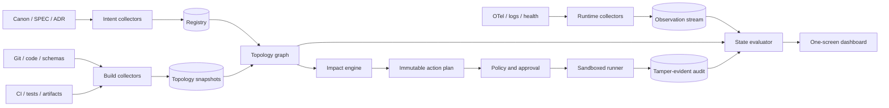
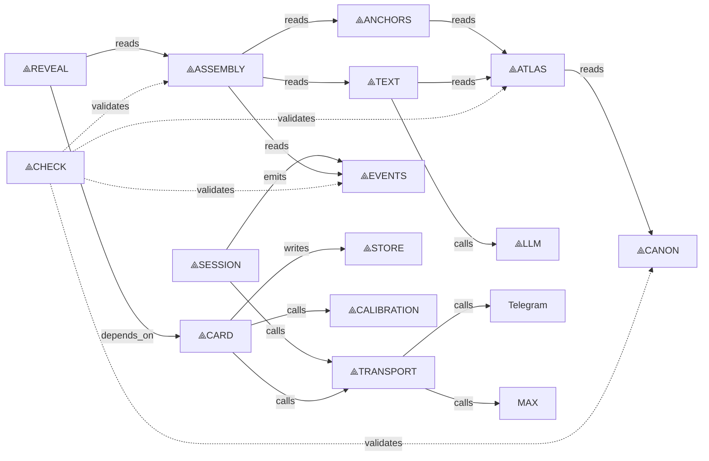

# GLT 2.0 — Glyph Language for Topology

> Наблюдаемая архитектура, анализ влияния изменений и контролируемые действия.

**Статус:** концепция и проектная спецификация, не принятая часть архитектуры ÆON.  
**Версия документа:** 0.1 · 14.08.2026.  
**Предшественник:** [`Glyph Language Template.md`](../Glyph%20Language%20Template.md) — исторический brainstorm GLT v0.1.

---

## 0. Тезис

Первый GLT пытался сжать намерение разработчика в глифовую команду, которую модель разворачивает в код. Полезное ядро оказалось не в генерации кода и не в способности модели «понимать символы», а в другой цепочке:

> **registry → типизированный граф → наблюдаемое состояние → анализ влияния → безопасное действие → trace**

GLT 2.0 сохраняет название, но меняет предмет:

- **глиф** становится устойчивым визуальным адресом системного узла;
- **язык** описывает узлы, связи, запросы влияния и допустимые действия;
- **топология** соединяет намерение, код, инфраструктуру и живой runtime;
- **дашборд** показывает систему целиком и подсвечивает изменение там, где оно имеет последствия;
- **runner** исполняет только зарегистрированные действия после проверки политики;
- **trace** делает наблюдение и действие аудируемым, а детерминированную часть — воспроизводимой.

GLT 2.0 — не новый источник истины и не «магический язык для LLM». Это **control plane над существующими источниками истины**.

Его задача — сократить путь:

> **изменение или поломка → локализация → понимание последствий → правильная проверка → безопасное действие**

---

## 1. Какую проблему решает GLT 2.0

В достаточно сложном проекте знание распределено между:

- продуктовыми правилами;
- архитектурными решениями;
- кодом и схемами;
- тестами и инвариантами;
- CI;
- конфигурацией окружений;
- артефактами сборки;
- runtime-телеметрией;
- очередями, хранилищами и внешними провайдерами;
- памятью людей.

Обычный dashboard отвечает на вопрос «какие числа сейчас плохие». Обычный каталог компонентов отвечает на вопрос «что у нас есть». CI отвечает на вопрос «какие проверки упали».

Ни один из них сам по себе не отвечает сразу на пять вопросов:

1. **Что именно изменилось или сломалось?**
2. **Какой контракт за этим стоит?**
3. **Какие части системы реально затронуты?**
4. **Что обязательно проверить?**
5. **Какое действие сейчас разрешено и безопасно?**

GLT соединяет эти ответы через один типизированный граф.

### 1.1. Ценность для разных ролей

**Владелец продукта** видит, какая часть обещания уже материализована, какая только описана и где система не подтверждает задуманное.

**Архитектор** видит расхождение между декларированной и фактической топологией, нарушение границ и blast radius изменения.

**Разработчик** получает короткий путь от изменённого файла к обязательным тестам, исходным решениям и безопасным действиям.

**Оператор** видит не россыпь метрик, а состояние узлов, пути возможного распространения отказа и подтверждённое trace-parentage.

**LLM-агент** получает ограниченный, версионированный контекст вместо попытки заново угадать архитектуру по всему репозиторию.

### 1.2. Что GLT принципиально не решает

GLT не определяет:

- правильно ли выбрано продуктовое обещание;
- хорош ли текст, дизайн или методология;
- истинно ли непроверяемое человеком содержание;
- какую архитектуру следует выбрать с нуля;
- можно ли считать отсутствие сигнала здоровьем;
- можно ли исполнять действие только потому, что его предложила модель.

GLT может показать происхождение решения, статус проверки и пробел в знании. Он не превращает неизвестное в известное.

---

## 2. Что сохраняется и что отбрасывается из GLT v0.1

### 2.1. Сохраняется

**Смысловое сжатие.** Короткая запись полезна, если она адресует заранее согласованный контракт, а не заменяет его.

**Registry.** Связь «глиф → стабильный ID → контракт» является центром системы.

**Action Graph.** Цепочка должна превращаться не в свободный prompt, а в проверяемый граф действий и зависимостей.

**Trace.** У каждого запуска должен быть идентификатор, вход, версии, результат и хронология.

**Визуальная композиция.** Система легче воспринимается как устойчивая пространственная карта, чем как список разрозненных сервисов и графиков.

**Раскрытие от символа к подробности.** Глиф даёт быстрый обзор, но по клику обязан раскрыться в полный контракт, источники и доказательства.

Это направление уже было намечено в старом `GlyphChain Protocol`: registry, JSON Schema, Action Graph, Runner API и trace log (`Glyph Language Template.md`, строки 1192–1206).

### 2.2. Отбрасывается

**Предположение, что модель знает язык глифов.** Модель распознаёт знакомые слова и паттерны, но это не стабильный протокол.

**Смысл по ассоциации.** `🚀` может означать запуск, deploy, release или маркетинговый старт. Без registry это неоднозначный рисунок.

**LLM как компилятор и валидатор одновременно.** Модель может предложить план, но не является источником семантики, политики или разрешения.

**LOC как мера ценности.** Количество строк на глиф стимулирует объём, а не корректность, сопровождаемость или полезный результат.

**Неявные defaults.** Сжатие не должно прятать решения о безопасности, данных, надёжности и UX.

**Автоматические commit, push и deploy как post-hook.** Необратимые и внешние действия требуют отдельных политик и отдельных подтверждений.

**Секретный словарь как защита продукта.** Практическая ценность находится в качественном registry, интеграциях, проверках и накопленной карте системы, а не в тайне символов.

---

## 3. Теоретическая модель

### 3.1. Глиф — адрес, а не значение

У глифа четыре участника:

1. **Знак** — видимый символ или текстовый alias.
2. **Адресат** — стабильный машинный ID.
3. **Контракт** — зарегистрированный смысл ID.
4. **Контекст** — namespace, версия registry и область применения.

Разрешение глифа формально выглядит так:

```text
resolve(alias, namespace, registry_version)
  -> { semantic_id, revision } | error
```

Например:

```text
⟁TEXT
  → id: aeon.domain.text
  → revision: 1
  → контракт слоя текстовых зондов
```

`⟁TEXT` можно заменить другим рисунком или локализованной подписью. `aeon.domain.text` остаётся стабильным ID, revision хранится отдельно, а закреплённая ссылка сериализуется как `aeon.domain.text@1`. В событиях, API, кэше, планах и traces хранится ID с явной revision, а не картинка и не неявный `latest`.

Если alias неизвестен или неоднозначен, результат — ошибка. Модель не должна «догадаться».

Versioning v1:

- semantic ID стабилен и не переиспользуется;
- revision — монотонное целое внутри одного ID;
- любое изменение исполняемого смысла, schema, defaults или effects увеличивает revision;
- совместимость хранится явно как `compatible_with`, а не угадывается из номера;
- версия registry использует SemVer и определяет набор доступных `(id, revision)`;
- resolve всегда возвращает закреплённую revision; неявного `latest` в plan и trace нет.

### 3.2. Пять артефактов GLT

**Слой 1 — представление.**

Глифы, подписи, пространственное положение, цветовые и анимационные состояния. Это человеческий интерфейс.

**Слой 2 — registry.**

Версионированный каталог ID, ссылок на контракты, схем аргументов, связей, источников, сигналов, действий и политик.

**Слой 3 — topology snapshot.**

Версионированное машинное представление узлов и типизированных рёбер на момент `as_of`. Оно не зависит от шрифта, языка UI или выбранной визуализации.

**Слой 4 — потоки фактов.**

Наблюдения, action traces и audit records живут отдельно от topology snapshot. Динамический сигнал не переписывает граф задним числом.

**Слой 5 — проекции и планы.**

Из snapshot и потоков строятся:

- dashboard;
- текстовое объяснение;
- impact report;
- action plan;
- CI gate;
- runtime overlay;
- документация;
- prompt-контекст для агента;
- trace.

Registry, topology snapshot, observation stream, execution DAG и audit trace имеют разные схемы и жизненные циклы. Детерминированным обязан быть topology snapshot при закреплённых source digests, версиях collectors, их конфигурации и `as_of`. Проекция не обязана быть обратимой, но обязана ссылаться на точные входные версии и не добавлять неподтверждённые факты.

### 3.3. Разные модели нельзя смешивать

GLT не должен смешивать:

**Registry schema** — какие типы узлов и отношений допустимы.

**Topology snapshot** — какие конкретные узлы и связи утверждались, обнаруживались или наблюдались на выбранный момент.

**Observation stream** — изменяющиеся сигналы со временем наблюдения и TTL.

**Execution DAG** — какие действия и в каком порядке будут выполнены в одном запуске.

**Audit trace** — что фактически произошло при запуске и какие внешние receipts получены.

Список символов по порядку — ещё не граф зависимостей. У каждого ребра должен быть тип:

- `depends_on`;
- `reads`;
- `writes`;
- `calls`;
- `emits`;
- `consumes`;
- `builds`;
- `validates`;
- `observes`;
- `gates`;
- `deployed_as`;
- `conflicts_with`.

Порядок исполнения является лишь одним из видов связи.

### 3.4. Три состояния одной системы

GLT моделирует проект сразу в трёх плоскостях:

**Intended — задуманное.**

Что обещают канон, спецификация, ADR и план разработки; registry только индексирует эти утверждения и добавляет GLT-метаданные.

**Materialized — реализованное.**

Что действительно обнаружено в коде, схемах, тестах, CI и артефактах сборки.

**Observed — работающее.**

Что реально развёрнуто и наблюдается через health checks, traces, метрики и логи.

Сравнение этих плоскостей даёт полезные классы расхождений:

- описано, но ещё не должно быть реализовано — нормальный план;
- должно быть реализовано к текущему этапу, но отсутствует — gap;
- реализовано, но нигде не описано — shadow architecture;
- собрано, но не развёрнуто — release gap;
- развёрнуто с другим hash — drift;
- работает, но не наблюдается — telemetry gap;
- наблюдается узел, которого нет в текущем артефакте — stale deployment или ошибка инвентаризации.

Это превращает dashboard из «карты сервисов» в **цифровой двойник архитектурного намерения**.

### 3.5. Когнитивное сжатие

Глиф не создаёт информацию. Он переносит подробность в общий словарь.

Реальная стоимость короткой записи:

```text
стоимость GLT =
  чтение глифов
  + изучение registry
  + раскрытие скрытых параметров
  + уточнения
  + исправление неверной интерпретации
```

Поэтому GLT полезен, когда:

- понятия повторяются;
- их смысл стабилен;
- команда разделяет registry;
- скрытые defaults материализуются в topology snapshot;
- ошибку можно проверить;
- раскрытие доступно в один шаг.

Главный эффект — не экономия токенов и не скорость набора. Это **ускорение узнавания устойчивой структуры** и снижение стоимости навигации по ней.

### 3.6. Контур управления

Полный полезный цикл GLT:

```text
наблюдать
  → сопоставить сигнал с узлом
  → показать источник и зависимости
  → оценить влияние
  → предложить допустимый план
  → проверить политику
  → получить подтверждение
  → выполнить
  → записать trace
  → обновить снимок
```

Если система заканчивается красивой картинкой, это визуализатор. Если она заканчивается кнопкой произвольного shell, это опасная консоль. Read-only impact уже может быть полезным узким инструментом; полноценным Control Plane GLT становится только при наличии всего контура.

---

## 4. Базовые принципы

1. **Глиф адресует, registry определяет.**
2. **Один факт имеет один источник истины.** GLT хранит ссылку и проекцию, а не копию факта без происхождения.
3. **Стабильный ID важнее символа.**
4. **Неизвестное является состоянием, а не зелёным цветом.**
5. **Каждое ребро имеет тип и доказательство.**
6. **Каждый сигнал имеет источник, время наблюдения и TTL.**
7. **Здоровье, изменение, активность и свежесть — разные измерения.**
8. **Декларированное, обнаруженное и наблюдаемое не смешиваются.**
9. **LLM предлагает и объясняет, но не определяет факты и разрешения.**
10. **Побочный эффект требует policy, dry-run и trace.**
11. **Чем выше риск, тем меньше свободы интерпретации.**
12. **Глиф всегда имеет текстовое раскрытие и доступное имя.**
13. **Проекция не может молча изменить семантику исходного графа.**
14. **Любой зелёный статус должен отвечать на вопрос «на основании чего?».**
15. **Красивый граф без читателя, runbook и действия не считается результатом.**

---

## 5. Инварианты протокола

GLT 2.0 обязан соблюдать следующие машинно проверяемые правила:

1. Один `(alias, namespace, registry_version)` разрешается максимум в один semantic ID.
2. Неизвестный или неоднозначный alias не исполняется.
3. Одинаковые source digests, grammar, registry, collector versions/config, profile и `as_of` дают одинаковый topology snapshot.
4. Каждый узел имеет стабильный ID, kind и schema-valid свойства.
5. Все defaults материализуются в topology snapshot.
6. Каждое ребро имеет тип, источник и уровень доказанности.
7. Execution graph не содержит циклов порядка.
8. Alias нельзя переназначить внутри совместимой версии registry.
9. Изменение смысла создаёт новую revision.
10. Каждый снимок закреплён за git SHA, artifact digest или deployment ID.
11. Просроченный сигнал не участвует в расчёте здоровья как актуальный.
12. Отсутствие сигнала не интерпретируется как `healthy`.
13. LLM не может добавить неизвестный action ID или capability.
14. Action plan закреплён подписываемым envelope вместе с revision, environment, topology snapshot, ActionSpec, policy, executor image, input и credential-scope digests.
15. Изменение любого поля envelope аннулирует approval; policy повторно проверяется непосредственно перед запуском.
16. Никакое внешнее действие не выполняется без tamper-evident audit trace и попытки, записанной до эффекта.
17. Commit, push, migration и deploy являются разными действиями и подтверждаются отдельно.
18. Сырые персональные данные не попадают в topology graph и control-plane traces.

---

## 6. Архитектура Glyph Control Plane



### 6.1. Компоненты

**Registry compiler**

Проверяет записи registry, разрешает aliases, нормализует Unicode, материализует defaults и строит topology snapshot.

**Intent collectors**

Читают декларативные источники: канон, SPEC, ADR, планы разработки, контракты и ручные registry-записи.

**Build collectors**

Получают факты из git, структуры модулей, import graph, схем, тестов, CI и манифестов артефактов.

**Runtime collectors**

Получают безопасные агрегаты из OpenTelemetry, структурных логов, health endpoints, очередей и deploy metadata.

**Topology graph**

Собирает версионированные topology snapshots из registry и evidence. Динамические наблюдения и audit records хранятся отдельными потоками.

**State evaluator**

Вычисляет независимые состояния узла и evidence, на которых основано каждое состояние.

**Impact engine**

Принимает детерминированно классифицированное изменение, проходит только по релевантным типам рёбер и выдаёт blast radius. Incident propagation является отдельным режимом.

**Action planner**

Преобразует запрос в immutable plan из зарегистрированных действий.

**Policy engine**

Проверяет capabilities, среду, риск, freshness графа и необходимость подтверждений.

**Runner**

Исполняет allowlisted действия в изоляции. Произвольный shell не является API GLT.

**Trace store**

Хранит hash-chained audit records: вход, signed plan envelope, версии, подтверждения, попытки, результаты и внешние receipts.

**Dashboard**

Даёт одну пространственную проекцию для понимания, диагностики и запуска разрешённых проверок.

### 6.2. GLT не является источником истины

Registry-запись обязана различать:

- **declaration** — что проект утверждает;
- **discovery** — что найдено в коде или инфраструктуре;
- **observation** — что подтверждено живым сигналом;
- **inference** — что вычислено из других фактов.

Каждое значение содержит provenance:

```yaml
value: healthy
provenance:
  class: observation
  source: otel
  observed_at: 2026-08-14T10:00:00Z
  ttl_seconds: 60
  evidence_ref: trace://01J...
```

Inference никогда не отображается как прямое наблюдение. Ручная декларация не изображается как runtime-факт.

Авторитет определяется не общим приоритетом документов, а классом факта:

- `archecode/` авторитетен для методологии и содержания архетипической карты;
- принятые `docs/SPEC/` и `decision-log.md` — для инженерных решений;
- git tree, schemas, test reports и artifact attestations — для materialized/build-фактов;
- deployment metadata и telemetry — для observed/runtime-фактов;
- registry — только для GLT-ID, aliases, визуальных метаданных, SourceRef, ActionSpec и policy.

Registry не вправе переопределять продуктовый или инженерный контракт. Если два авторитетных для одного класса источника расходятся, узел получает `conflicted`; impact считается неполным, а действия выше `read` блокируются.

`SourceRef` должен указывать не только путь:

```yaml
source_ref:
  repository: aeon-profile
  commit: 0123456789abcdef
  path: docs/SPEC/llm-contract.md
  selector: lines:13-33
  digest: sha256:...
  authority: engineering-contract
```

Для YAML/JSON предпочтителен JSON Pointer, для кода — symbol ID или диапазон закреплённой revision. Ссылка без commit и digest годится для навигации, но не для approval.

### 6.3. Модель узла

Полная запись целевой модели:

```yaml
apiVersion: glt.dev/v1alpha1
kind: Node
metadata:
  id: aeon.domain.text
  revision: 1
  namespace: aeon
  aliases: [⟁TEXT, text-layer]
  title: Текстовый слой
spec:
  type: domain
  lifecycle: planned
  delivery:
    expectedFromStep: DEV-17
    gate: aeon.gate.dev-17
    status: planned
  criticality: high
  sensitivity: personal
  owner: product
  sources:
    - repository: aeon-profile
      commit: 0123456789abcdef
      path: docs/SPEC/llm-contract.md
      selector: lines:13-118
      digest: sha256:...
      role: contract
    - repository: aeon-profile
      commit: 0123456789abcdef
      path: archecode/aeon-speka-klassifikator-2.yaml
      selector: /
      digest: sha256:...
      role: canon
  capabilities:
    - text.classify
  signals:
    - aeon.signal.llm-latency
    - aeon.signal.llm-retries
    - aeon.signal.unreliable-probes
```

Обязательные поля узла:

- ID и revision;
- kind;
- aliases и текстовое имя;
- owner;
- criticality;
- sensitivity;
- lifecycle;
- delivery status, expected gate и evidence перехода;
- source references;
- связанные contracts;
- signals;
- capabilities;
- политика deprecation.

Связанные проверки не хранятся в Node: они вычисляются из входящих `validates`-рёбер. Иначе `Node.checks` и topology становятся двумя источниками одного факта.

### 6.4. Модель ребра

```yaml
apiVersion: glt.dev/v1alpha1
kind: Edge
metadata:
  id: aeon.edge.text-calls-llm
spec:
  from: aeon.domain.text
  to: aeon.port.llm
  relation: calls
  assertions:
    - plane: intended
      status: asserted
      evidence:
        class: declaration
        source_ref:
          repository: aeon-profile
          commit: 0123456789abcdef
          path: docs/SPEC/architecture.md
          selector: lines:94-104
          digest: sha256:...
    - plane: materialized
      status: not_observed
      evidence: null
    - plane: observed
      status: not_observed
      evidence: null
  propagation:
    change:
      - interface
    incident:
      - availability
```

Ребро хранит:

- направление;
- тип;
- отдельные assertions для каждой плоскости;
- классы изменений и отказов, которые по нему распространяются;
- evidence, derivation и freshness каждого assertion;
- независимую оценку confidence, если она вообще вычисляется.

`declared`, `discovered`, `observed` и `inferred` — классы происхождения, а не уровни уверенности. Одно intended-ребро не доказывает наличие того же ребра в build или runtime.

### 6.5. Состояние узла

Один `red/green` статус недостаточен. Узел имеет независимые оси:

```yaml
verification: passed       # unknown | pending | passed | failed | blocked
runtime: degraded          # unknown | healthy | degraded | unhealthy | unreachable
freshness: current         # current | drifted | stale
change: modified           # unchanged | modified | added | removed
activity: active           # idle | active | waiting | retrying
coverage: partial          # unknown | partial | complete
delivery: planned          # planned | ready | in_progress | verified | blocked
conflict: none             # none | source_conflict
```

Итоговая индикация — проекция этих осей, а не потеря информации в одном числе.

`delivery` вычисляется из ресурсов `DevStep` и `Gate`, а не выставляется вручную на dashboard. Каждый переход содержит evidence: закрытый gate, отчёт проверки или явную блокировку.

---

## 7. Визуальный язык

### 7.1. Что кодирует глиф

Сам рисунок кодирует только **идентичность класса или устойчивого узла**. Динамическое состояние передаётся отдельными каналами:

- форма или базовый знак — identity;
- контур — verification;
- заливка или штриховка — runtime health;
- пульсация — activity;
- badge — изменение, число инцидентов или ожидающее подтверждение;
- состояние подписи — freshness;
- подсветка рёбер — blast radius или активный trace;
- разрыв ребра — нарушенный контракт;
- пунктир — inferred или неполная связь.

Цвет никогда не является единственным носителем смысла.

### 7.2. Правила читаемости

- На основном экране одновременно не более 12–20 узлов верхнего уровня.
- Группы раскрываются внутрь по требованию.
- У каждого глифа всегда есть короткая текстовая подпись.
- Hover и keyboard focus раскрывают полный статус.
- Один и тот же узел сохраняет положение между сессиями.
- Автоматическая раскладка не должна каждый раз переставлять карту.
- Состояние `unknown` визуально заметно и не похоже на `healthy`.
- Анимация используется только для текущей активности и может быть отключена.
- Все действия доступны с клавиатуры и screen reader.
- Emoji допустимы как alias, но не как единственный канонический знак.

### 7.3. Один экран

`One-screen` означает один непрерывный workflow, а не одновременный показ всех данных. Главная персона MVP — разработчик, проверяющий влияние изменения. Режим по умолчанию — `Change`: карта и основание статуса в центре, evidence выбранного узла справа; поиск свёрнут, нижний drawer появляется только после запроса impact или запуска проверки. Runtime и History являются отдельными режимами той же пространственной карты.

**Верхняя полоса идентичности**

- проект;
- environment;
- git SHA и deployment ID;
- artifact и canon hash;
- свежесть снимка;
- число критических расхождений.

**Центр**

- устойчивая топология;
- переключатель `Intended / Build / Runtime / Combined`;
- фильтр `Change / Incident / Trace / Owner`;
- подсветка blast radius.

**Левая панель**

- registry;
- поиск по ID, alias, файлу, контракту и владельцу;
- фильтры по состоянию и criticality.

**Правая панель узла**

- полное имя и ID;
- зачем узел существует;
- sources и versions;
- контракты и инварианты;
- входящие и исходящие связи;
- текущие сигналы с TTL;
- связанные изменения;
- обязательные проверки;
- runbook.

**Нижний drawer**

- impact report;
- immutable action plan;
- diff между снимками;
- approval;
- live trace;
- результат и артефакты.

Основной путь не требует перехода на отдельные страницы:

> выбрать красный или изменённый глиф → увидеть evidence статуса → увидеть влияние → запустить разрешённую проверку → получить trace

### 7.4. Режимы dashboard

**Architecture**

Показывает устойчивую структуру и границы.

**Change**

Привязывает git diff к узлам и подсвечивает потенциальное влияние.

**Runtime**

Накладывает health, latency, errors, queues и drift на ту же карту.

**Trace**

Анимирует наблюдённую последовательность конкретной сессии, сборки или action run без показа чувствительного payload. Причинность утверждается только там, где есть trace-parentage или отдельное causal evidence.

**History**

Сравнивает два снимка topology graph и объясняет, что появилось, исчезло или сменило версию.

---

## 8. Impact Engine

Impact analysis — основная прикладная функция GLT. Dashboard без неё показывает состояние, но не помогает безопасно менять систему.

### 8.1. Вход

Режим **change impact** принимает:

- git diff;
- изменение registry;
- новая версия схемы;
- ручной запрос по узлу;
- proposed action plan.

Режим **incident propagation** отдельно принимает:

- инцидент;
- просроченный или противоречивый сигнал;
- runtime trace;
- расхождение deployment/build hashes.

Change impact отвечает «что может потребовать проверки после изменения». Incident propagation отвечает «куда мог распространиться наблюдаемый отказ». Путь зависимости является кандидатом причинности, но не доказательством первопричины.

### 8.2. Правила распространения

До реализации фиксируется версионированная матрица:

```text
(relation, changed_endpoint, change_class)
  → direction + conditions + stop_rule + required_checks
```

Минимальные правила первого среза:

- `A depends_on B`: изменение контракта `B` влияет на `A`, обход идёт против направления ребра;
- `CHECK validates TARGET`: изменение `TARGET` требует `CHECK`, но не означает изменение самого check;
- `GATE gates CHECK`: обязательный или failed `CHECK` переводит `GATE` в `pending` или `blocked`;
- content-change не проходит через ребро, объявленное только для interface-change;
- `conflicts_with` не распространяет impact, а создаёт отдельную проверку конфликта;
- incident проходит по observed assertions и по materialized-связям из реально развёрнутого artifact. Materialized path помечается как кандидат распространения, observed trace-parentage — как подтверждение; change impact может использовать intended и materialized assertions с явной маркировкой.

Обход выполняется по состояниям `(node_id, class)` с visited-set. Цикл topology допустим, цикл execution-order — нет.

### 8.3. Алгоритм change impact

1. Сопоставить изменённые файлы и артефакты с source references узлов.
2. Детерминированно и multi-label классифицировать изменение:
   - content;
   - schema;
   - interface;
   - behavior;
   - dependency;
   - configuration;
   - policy;
   - infrastructure.
3. Если классификация неоднозначна, применить консервативное объединение правил или заблокировать high-risk plan. LLM может предложить labels только как candidate для review.
4. Выбрать строки propagation matrix для всех labels.
5. Пройти по типизированным рёбрам с учётом endpoint и plane.
6. Остановиться по явным stop rules.
7. Собрать:
   - directly affected;
   - transitively affected;
   - required checks;
   - release gates;
   - approvals;
   - known unknowns;
   - stale evidence;
   - coverage boundary.
8. Рассчитать не «вероятность безопасности», а уровень полноты доказательств.

### 8.4. Выход

```yaml
change:
  source: archecode/aeon-protokol-tekst.yaml
  class: content
affected:
  direct:
    - aeon.canon.text-protocol
  transitive:
    - aeon.domain.text
must_run:
  - aeon.check.text-slice
check_requirements:
  - canon-compile
  - text-contract
  - prompt-isolation
must_review:
  - aeon.review.content
coverage:
  boundary: aeon.text-slice@1
  state: established
known_unknowns: []
release:
  gate: aeon.gate.text-slice
  state: blocked
  reason: checks_not_passed
```

### 8.5. Неизвестность повышает риск

Если граф неполон, Impact Engine не пишет «затронут только один узел». Он пишет:

```text
known impact: 3 nodes
known unknowns: 2 stale edges, 1 unowned node
coverage: not established outside aeon.text-slice@1
```

Отсутствующее ребро нельзя обнаружить по самому графу. Поэтому каждый исполняемый срез имеет независимый boundary manifest и golden cases. Без сертификата покрытия формулировка «полное влияние» запрещена, а действия высокого риска блокируются.

---

## 9. Action Graph и безопасный Runner

### 9.1. GLT-запрос

Глифовая запись остаётся удобной проекцией:

```text
@aeon/local
⟁IMPACT(path="archecode/aeon-protokol-tekst.yaml")
  → ⟁CHECK(canon, text-contract, prompt-isolation)
  → ⟁GATE(review)
```

Но выполняется не строка. Она компилируется в canonical action plan со стабильными ID и материализованными параметрами.

### 9.2. ActionSpec

```yaml
apiVersion: glt.dev/v1alpha1
kind: Action
metadata:
  id: aeon.check.canon
  revision: 1
spec:
  declared_risk: read
  executor: builtin:canon.validate
  executor_image: sha256:...
  capabilities:
    filesystem:
      source: read_only
      scratch: write
    network: none
    credentials: none
    subprocess: denied
  accepts:
    type: object
    additionalProperties: false
  preconditions:
    - graph.fresh
    - workspace.clean-enough-for-read
  effects:
    workspace: none
    network: none
    external: none
  produces:
    - canon-validation-report
  timeout_seconds: 120
```

Runner получает `executor ID`, а не произвольную shell-строку. Итоговый risk вычисляется policy из capabilities, environment и входов; название `test` или `read` само по себе ничего не гарантирует.

### 9.3. Классы риска

**Read**

Инвентаризация, health, graph query, чтение отчётов.

**Build**

Компиляция, lint, typecheck, тесты, dry-run миграции без изменения целевой среды. Код проверяемой ветки считается недоверенным: тест способен запустить subprocess, прочитать env, записать файл или открыть сеть.

**Workspace write**

Форматирование или генерация файлов в рабочей копии. Требует явного подтверждения и review diff.

**External write**

Изменение issue, PR, registry, удалённого хранилища или другой внешней системы. Отдельное подтверждение.

**Production**

Миграция, deploy, rollback, ротация секрета. Строгая policy, отдельный approval и проверенный runbook.

### 9.4. Жизненный цикл запуска

```text
draft
  → validated
  → planned
  → dry_run
  → awaiting_approval
  → approved
  → queued
  → running
  → succeeded | failed | canceled | expired | unknown_outcome
  → reconciling → succeeded | failed
```

Любое изменение signed plan envelope переводит approval в `invalidated`.

### 9.5. Правила исполнения

- deny by default;
- allowlist действий;
- pinned versions;
- disposable VM или rootless container;
- immutable checkout и read-only source mount;
- отдельный scratch, пустые `HOME` и environment;
- отсутствие Docker socket и host credentials;
- seccomp/cgroups и pinned signed executor image;
- network off по умолчанию; разрешённый egress только через policy broker;
- минимальные короткоживущие credentials;
- лимит времени и ресурсов;
- allowlist output schema и redaction до записи;
- target-side idempotency token, если целевая система его поддерживает;
- dry-run перед write-действием;
- отдельный approval на каждый класс внешнего эффекта;
- write-ahead audit attempt до побочного эффекта;
- внешний receipt после эффекта;
- hash-chained tamper-evident audit;
- postcondition check;
- отсутствие автоматического commit, push и deploy в MVP.

Idempotency key не доказывает, что эффект не повторился. Если runner потерял связь после внешнего write и не получил receipt, состояние — `unknown_outcome`; требуется reconciliation с целевой системой, а не автоматический retry.

---

## 10. Роль LLM

Современная модель полезна в GLT, если её роль ограничена доказательствами графа.

### 10.1. Модель может

- преобразовать естественный запрос в graph query;
- предложить candidate nodes и edges для review;
- предложить candidate labels изменения для review;
- объяснить blast radius по уже найденным рёбрам;
- собрать plan из зарегистрированных ActionSpec;
- суммировать trace и связать ошибки с runbook;
- сравнить два снимка;
- предложить, какой недостающий collector даст больше покрытия;
- помогать автору registry, не публикуя запись самостоятельно.

### 10.2. Модель не может

- назначить смысл неизвестному глифу;
- создать capability;
- объявить узел здоровым без сигнала;
- скрыть `unknown`;
- изменить source of truth;
- выполнить произвольную команду;
- одобрить собственный plan;
- считать inferred edge доказанным;
- превращать ручную или человеческую проверку в машинно пройденную;
- читать чувствительный payload только ради объяснения topology;
- единолично выбирать change class, от которого зависит release gate.

### 10.3. Проверяемый ответ модели

Объяснение должно ссылаться на:

- node IDs;
- edge IDs;
- source references;
- signal IDs;
- snapshot version;
- action IDs.

Если объяснение нельзя выразить через эти ссылки, оно остаётся гипотезой, а не основанием для действия.

---

## 11. Применение к ÆON

Текущий ÆON подходит для узкого статического GLT-пилота, но ещё не для полного Control Plane. Проект находится на pre-code стадии: есть подробные источники и план, но пока нет продуктового runtime, CI-графа и эксплуатационной истории.

- архитектура уже описана графом и модульными границами;
- `archecode/` является явным источником истины;
- компиляция канона в типизированный JSON спроектирована;
- неизменяемый Event Core спроектирован;
- есть версионируемый LLM-контракт;
- определены инварианты, паритет и численные ожидания;
- наблюдаемость задумана как сверка живых данных с симуляцией;
- разработка разбита на 27 зависимых шагов.

На этом этапе GLT не заменяет эти документы и не должен блокировать слепой тест или критический путь продукта. Его первая задача — проверить на четырёх узлах, ускоряет ли связанная карта навигацию и анализ изменения. Build plane имеет смысл не раньше DEV-04, Runtime plane — после DEV-25/26.

### 11.1. Начальный алфавит ÆON

`⟁CANON` — методологический источник истины, версии и hash.

`⟁ATLAS` — карточки, протоколы, схемы и типизированная компиляция.

`⟁EVENTS` — append-only Event Core и версии payload.

`⟁SESSION` — жизненный цикл карты.

`⟁ANCHORS` — детерминированный первый слой.

`⟁TEXT` — второй слой, prompt contract и LLM-чтения.

`⟁ASSEMBLY` — роли, разрыв и отказы сборки.

`⟁REVEAL` — доменное содержание частей ревила.

`⟁CARD` — общий lifecycle карты, рендер, хранилище и доставка.

`⟁CALIBRATION` — отложенная проверка предсказаний.

`⟁TRANSPORT` — Telegram, MAX и общий порт.

`⟁LLM` — провайдер, ретраи, версии промптов и стоимость.

`⟁STORE` — PostgreSQL, Redis/BullMQ и MinIO.

`⟁CHECK` — Zod, validator, parity, dependency rules и тесты.

`⟁SIGNAL` — метрика, лог, alert или health.

`⟁GATE` — CI, review, approval или release policy.

Это будущий верхний уровень. В первом пилоте обязательны только текстовые ID четырёх узлов `CANON → TEXT → CHECK → GATE`; глифы являются необязательными aliases. Остальной алфавит вводится после отдельной проверки H6.

### 11.2. Топология верхнего уровня



Каждая стрелка читается строго как `source —relation→ target`; это не единый data-flow. Проекция основана на разделении из [`docs/SPEC/architecture.md`](SPEC/architecture.md), но остаётся иллюстрацией. Для impact каждое ребро сначала получает ID, assertions, propagation rule и SourceRef.

### 11.3. Intended plane для текущего этапа

Пока продукт ещё не реализован, статическая карта потенциально полезна:

- показывает 27 DEV-шагов и их зависимости;
- различает `planned`, `ready`, `in progress`, `verified`, `blocked`;
- связывает каждый шаг с SPEC, каноном и критериями готовности;
- подсвечивает незакрытый предшествующий шаг;
- показывает, какие узлы архитектуры должны появиться после каждого этапа;
- выявляет spec drift до появления runtime.

Плановый узел не считается сломанным только потому, что кода ещё нет. У него есть `expected_from_step`. Gap возникает лишь после прохождения соответствующего gate.

Статусы, зависимости и `expected_from_step` должны извлекаться из машинно читаемых метаданных DEV-документов или их индекса. Вручную хранятся только GLT-ID и SourceRef. Если для поддержки карты приходится повторно размечать все 27 шагов, пилот останавливается как второй источник истины.

### 11.4. Build plane

Когда появляется код, collectors добавляют:

- git SHA;
- module/import graph;
- нарушение границ `dependency-cruiser`;
- результат YAML → JSON;
- canon hash;
- Zod validation;
- validator атласа;
- 56 и 1120 паритетных сценариев;
- typecheck, lint, unit/property/contract tests;
- fake end-to-end;
- migration dry-run;
- artifact digest.

Правила сборки и источники для этих сигналов уже описаны в [`docs/DEV/03-kanon-v-kod.md`](DEV/03-kanon-v-kod.md), [`docs/SPEC/invariants.md`](SPEC/invariants.md) и [`docs/DEV/27-skvoznaya-priyomka.md`](DEV/27-skvoznaya-priyomka.md).

### 11.5. Runtime plane

Runtime overlay получает только необходимые агрегаты:

- transport errors отдельно для Telegram и MAX;
- задержку ответа;
- BullMQ lag;
- LLM latency, retries, final failures, model и prompt version;
- стоимость и token usage без prompt content;
- invariant violations;
- render и delivery failures;
- health PostgreSQL, Redis и MinIO;
- deployment, migration и canon hashes;
- completion и drop-off;
- сверку живых распределений с симуляцией.

Список продуктовых сигналов уже определён в [`docs/SPEC/observability.md`](SPEC/observability.md). GLT добавляет к ним топологию, provenance, impact и действие.

### 11.6. Приватность ÆON

В Control Plane не попадают:

- тексты ответов человека;
- цитаты из `text_read`;
- platform user ID;
- payload персональных событий;
- содержимое промптов;
- подписанные ссылки на ревил;
- секреты транспортов и провайдера.

Для topology достаточно:

- event type и schema version;
- агрегированной частоты;
- latency и status;
- model/prompt version;
- отдельного opaque control-plane trace ID, не производного от пользователя;
- purpose-, platform- и environment-scoped HMAC с разными ключами только там, где без межсистемной корреляции нельзя обойтись.

Plain hash пользовательского идентификатора или текста запрещён: малое пространство значений и стабильность делают его сопоставимым. Идентификаторы имеют ограниченный retention и не переиспользуются между целями обработки.

Product Event Core и audit Control Plane — разные журналы.

### 11.7. Пять показательных сценариев

**Изменён протокол текста**

Загораются `⟁CANON` и `⟁TEXT`; Impact Engine показывает prompt contract, text fixtures, изоляцию и сборку. Release gate ждёт обязательные проверки.

**LLM-провайдер деградировал**

`⟁LLM` становится `degraded`, `⟁TEXT` показывает retries и lag. `⟁ANCHORS` остаётся здоровым. `⟁ASSEMBLY` показывает предусмотренный риск отказа слоя, а не общий «всё красное».

**Схема события изменилась**

Подсвечиваются producers, consumers, read models и replay tests. Старые события остаются на прежней schema version.

**Очередь калибровки отстаёт**

Краснеет `⟁CALIBRATION` и ребро к `⟁STORE/QUEUE`; основной диалог не объявляется сломанным. Dashboard открывает runbook восстановления задания из событий.

**Canon hash в prod отличается от артефакта**

Узел получает `freshness: drifted`; release и write-actions блокируются до объяснения происхождения расхождения.

---

## 12. Эффективность: что именно измерять

GLT нельзя обосновывать впечатлением от красивой карты. Его ценность должна сравниваться с существующим способом работы.

### 12.1. Проверяемые гипотезы

**H1. Локализация**

Человек быстрее находит источник правила, затронутые узлы и обязательные проверки.

**H2. Понимание**

Человек точнее объясняет путь зависимостей и влияния и меньше пропускает обязательные проверки.

**H3. Безопасное действие**

Человек быстрее выбирает правильную проверку или runbook без роста критических ошибок.

**H4. Диагностика**

Инцидент быстрее связывается с кандидатами источника отказа; первичный узел называется только при подтверждённом trace-parentage или другом causal evidence.

**H5. Onboarding**

Новый участник быстрее строит корректную mental model проекта.

**H6. Глифы**

Устойчивое глифовое представление даёт дополнительную пользу поверх обычного текстового графа.

Последняя гипотеза обязательна: возможно, полезен сам граф, а символы ничего не добавляют.

### 12.2. Три baseline

**B0 — текущий лучший процесс**

Cursor, поиск по репозиторию, документация, CI и существующие dashboard.

**B1 — текстовый topology graph**

Те же узлы, связи, impact, actions, экран, позиции, цвета и взаимодействия, но только с текстовыми именами.

**G — полный GLT**

Тот же интерфейс и та же пространственная раскладка; единственное экспериментальное отличие — устойчивый глиф рядом с текстовой расшифровкой.

Сравнение B0 с G показывает пользу всей системы. Сравнение B1 с G отделяет пользу глифов от пользы графа.

### 12.3. Главные метрики

**Time to localization**

Время до правильного указания источника истины, затронутых узлов и обязательных проверок.

**Time to understanding**

Время до корректного объяснения зависимостей и влияния: что изменится, что не изменится и что остаётся неизвестным.

**Time to safe action**

Время до первой правильной проверки, runbook или подтверждённого plan.

**Time to verified result**

Время до результата, который прошёл заранее заданную проверку. Это главная временная метрика.

**Task success rate**

Доля заданий, закрытых по замороженной рубрике.

**Critical semantic error rate**

Доля задач, в которых допущена хотя бы одна ошибка, выглядящая правдоподобно, но нарушающая контракт, пропускающая критическую зависимость или предлагающая опасное действие. Критерии ошибки фиксируются в frozen rubric.

**Graph coverage**

Покрытие не количеством нарисованных узлов, а долей эталонных узлов, рёбер и критических путей с доказательством.

**Contract coverage**

Доля обязательств, классифицированных как:

- schema/type;
- domain/property test;
- parity;
- boundary lint;
- manual review;
- human validation;
- not verified.

Человеческие проверки не включаются в машинно зелёное покрытие.

**Freshness**

Доля source references и observed signals, чьи hashes и TTL актуальны.

**Alert precision и false-negative rate**

Нужно показывать и ложные срабатывания, и пропущенные дефекты. Снижение шума ценой пропуска критических нарушений неприемлемо.

**Cognitive load**

Mental effort 1–9, NASA-TLX, число возвратов к файлам, поисковых запросов и смен направления.

**Change failure rate**

После появления runner — доля выполненных изменений, потребовавших отката, hotfix или нарушивших контракт.

**Deployment rework**

Доля незапланированных изменений, сделанных для исправления последствий предыдущего deploy.

Последние две метрики согласуются с современным разделением DORA на throughput и stability, но не заменяют доменные метрики GLT.

### 12.4. Анти-метрики

Не использовать как доказательство ценности:

- LOC на глиф;
- LOC в час;
- число глифов;
- число узлов;
- число запущенных actions;
- время до первого diff;
- количество Accept;
- build success без смысловой приёмки;
- line coverage без связи с контрактами;
- количество алертов;
- субъективный «процент соответствия промпту»;
- adoption без измерения результата.

Эти числа могут быть диагностикой нагрузки, но не KPI.

### 12.5. Эксперимент

Pre-code корпус для `aeon.text-slice@1`:

1. Найти источник пяти разрешённых групп данных prompt второго слоя.
2. Объяснить запрет `p_anchor` и назвать проверку, которая обязана его удерживать.
3. Определить impact правки `aeon-protokol-tekst.yaml` внутри заявленной boundary.
4. Определить impact изменения схемы ответа классификатора второго слоя.
5. Обнаружить stale SourceRef после перемещения раздела контракта.
6. Корректно показать `coverage_not_established` за пределами text-slice.
7. Разделить машинные проверки и обязательный ручной review изменения текста.
8. Определить состояние `GATE`, если prompt-isolation check failed или ещё не запускался.

Расширенный корпус появляется только вместе с соответствующей стадией:

- Atlas/parity и падение validator — после Build Evidence;
- invariant violations — после появления доменного исполнения;
- canon/build/prod drift — после Runtime Overlay;
- отказ LLM против отказа детерминированного слоя — после сквозного fake/runtime trace.

Для команды подходит counterbalanced crossover:

- каждый участник проходит B0, B1 и G;
- порядок условий балансируется;
- задания различаются, но имеют одинаковую сложность;
- часть заданий остаётся holdout;
- оценка идёт вслепую по заранее замороженной рубрике;
- чистые и намеренно повреждённые сценарии смешиваются.

Для одного владельца проекта допустим N-of-1:

- минимум 12 сопоставимых задач **на каждое условие**;
- чередование B0/B1/G;
- matched-наборы и balanced order;
- фиксация критериев до начала;
- отдельный учёт эффекта обучения;
- вывод относится только к этому рабочему процессу.

Пилот делится на две части:

- **exploratory** — оценивает направление эффекта и помогает исправить UX;
- **acceptance** — использует замороженный holdout, число повторов и заранее заданный risk budget.

Нулевой пропуск на малой выборке не доказывает нулевой риск. Рядом с долей всегда показывается доверительный интервал; переход к runner нельзя обосновать только серией из нескольких десятков удачных демонстраций.

### 12.6. Стартовые go/no-go пороги

Это гипотезы для пилота, а не универсальная истина:

- медианное время локализации лучше B0 минимум на 25%;
- time to safe action лучше B0 минимум на 20%;
- task success не хуже baseline более чем на 5 процентных пунктов;
- critical semantic error rate не растёт;
- mental effort не ухудшается более чем на 0,5 пункта из 9;
- критические пути пилотного графа покрыты на 100%;
- freshness исполняемого графа — 100%;
- на замороженном holdout не пропущен ни один критический seeded-дефект; размер и классы holdout публикуются рядом с результатом;
- полный trace для каждого action — 100%;
- стоимость поддержки registry измеряется отдельно и не превышает сэкономленное время две итерации подряд.

Только после появления write-actions добавляются:

- неавторизованное действие — ноль;
- controlled runner имеет change failure rate не выше baseline;
- консервативная окупаемость на фактических затратах достигается в принятом владельцем горизонте.

Если G не превосходит B1, глифы остаются визуальным брендингом, а развивается текстовый topology graph.

### 12.7. Экономическая модель

```text
Total Cost =
  разработка
  + построение registry
  + интеграции collectors
  + обучение
  + поддержка freshness
  + runtime
  + review
  + разбор ложных алертов
  + ожидаемая стоимость failures
```

```text
Total Benefit =
  число задач × экономия времени до verified result
  + предотвращённые переделки
  + предотвращённые инциденты
  + экономия onboarding
  + сокращение времени восстановления
```

Считать нужно pessimistic, base и optimistic сценарии. Fixed cost графа нельзя прятать в стоимость первой демонстрации.

---

## 13. От validation prototype к MVP

MVP не начинается с IDE-плагина, генерации кода, полного алфавита или deploy-кнопки. На pre-code стадии ÆON полный Control Plane преждевременен.

Нужно различать:

- **validation prototype** — проверяет, есть ли польза от topology и глифов;
- **MVP** — закрывает один реальный workflow целиком;
- **target architecture** — будущая система из разделов 6–15.

MVP GLT для ÆON — только срез:

```text
TEXT depends_on CANON
CHECK validates TEXT
GATE gates CHECK
```

Он принимает один diff, находит источник, строит ограниченный impact, показывает обязательные проверки и сохраняет аудируемый read-only отчёт. Runtime, универсальный runner, approvals и карта всех 27 шагов в MVP не входят.

Минимальная модель MVP:

- Node: `id`, `title`, `sourceRefs`, `lifecycle`;
- Edge: только `depends_on`, `validates` и `gates`;
- CheckState: `unknown`, `pending`, `passed`, `failed`;
- GateState: `unknown`, `pending`, `open`, `blocked`;
- Freshness: `current`, `stale`;
- aliases: текстовый ID обязателен, глиф необязателен;
- coverage: только замкнутый boundary `aeon.text-slice@1`.

Этап 0 только замораживает правила измерения. Начиная с этапа 1, перед расширением применяются два независимых gate в объёме, доступном на данной стадии:

**Product gate**

- сравнение с B0;
- time to verified result;
- critical semantic errors;
- стоимость поддержки;
- решение `continue / revise / stop`.

**Safety gate**

- замороженный holdout;
- явно названные классы дефектов;
- freshness;
- отсутствие скрытого `unknown`;
- для runner — capabilities и audit.

Метрики вводятся по фазам:

- этап 1 — graph/contract coverage, correctness impact и стоимость ручной поддержки;
- этап 2 — B0/B1/G, time to localization/understanding и cognitive load;
- этапы 3–4 — time to verified result, freshness и collector maintenance;
- этап 5 — alert precision, false negatives, drift и incident localization;
- этапы 6–7 — plan correctness, audit completeness и runner risk budget.

### Этап 0. Measurement contract

Артефакты:

- эталонный подграф четырёх узлов;
- propagation rules для трёх типов рёбер;
- определения метрик;
- baseline B0;
- matched-задачи;
- seeded-дефекты и holdout;
- frozen rubric;
- ограничение времени и стоимости пилота.

Gate:

- ценность можно измерить до написания dashboard и runner.

### Этап 1. Static slice + Impact

Функции:

- четыре текстовых узла;
- source navigation;
- стабильная раскладка;
- сопоставление diff с `CANON`;
- детерминированная классификация content/schema;
- impact до `TEXT`, `CHECK`, `GATE`;
- known unknowns и boundary coverage;
- read-only report.

Не входит:

- ручная разметка всех 27 DEV-шагов;
- runtime;
- actions;
- универсальный registry.

Gate:

- все seeded-изменения первого среза дают ожидаемый impact;
- карта не дублирует факты без SourceRef;
- по сравнению с B0 есть сигнал пользы.

### Этап 2. B0 / B1 / G

Проводится контролируемое сравнение:

- B0 — текущий процесс;
- B1 — тот же topology UI с текстовыми метками;
- G — идентичный UI с добавленными глифами.

Gate:

- если B1 не лучше B0, topology не расширяется;
- если G не лучше B1, глифы остаются необязательными aliases;
- отрицательный net benefit две итерации подряд останавливает пилот.

### Этап 3. Build Evidence

Запускается не раньше DEV-04, когда появятся реальные код и CI.

Первые collectors:

- git;
- canon compile/hash;
- Zod;
- validator;
- parity;
- import boundaries;
- typecheck/tests;
- artifact digest.

Функции:

- Intended vs Materialized;
- CI overlay;
- freshness;
- release gates;
- обнаружение shadow architecture внутри утверждённой boundary.

Gate:

- изменение канона автоматически связывается с обязательными проверками;
- collector maintenance не дороже измеренной экономии.

### Этап 4. Расширение topology

Только после прохождения Product gate первого среза добавляются:

- другие доменные узлы;
- DevStep/Gate;
- дополнительные типы рёбер;
- автоматическое извлечение статусов из DEV-метаданных.

Ручное копирование статусов 27 шагов запрещено.

Gate:

- новый срез имеет собственный boundary manifest и golden cases;
- покрытие старого среза не ухудшилось.

### Этап 5. Runtime Overlay

Запускается после DEV-25/26, когда есть runtime и правила его чтения.

Collectors:

- health;
- OpenTelemetry;
- pino;
- BullMQ;
- deploy metadata;
- безопасные event aggregates.

Функции:

- Runtime mode;
- drift;
- stale signals;
- incident propagation;
- build/runtime version comparison.

Gate:

- fake e2e наполняет dashboard без живых пользовательских данных;
- telemetry allowlist и DLP-canary tests проходят.

### Этап 6. Shadow Runner

Запускается только если topology и impact уже доказали пользу.

Функции:

- immutable action plan;
- policy evaluation;
- capability calculation;
- dry-run;
- сравнение plan с реальными действиями разработчика;
- audit без изменения workspace.

Серия shadow-прогонов является exploratory evidence, а не доказательством нулевого риска. Переход дальше требует отдельного acceptance holdout и risk budget.

### Этап 7. Controlled Runner

Первый allowlist:

- inventory;
- validate registry;
- compile/validate canon;
- dependency check;
- typecheck;
- test;
- parity;
- fake e2e;
- health snapshot.

Не входят:

- изменение `archecode/`;
- commit;
- push;
- migration apply;
- deploy;
- изменение параметров;
- внешние write-actions.

Gate:

- каждое действие аудируемо по trace и receipts;
- write-действий нет;
- acceptance holdout пройден в пределах заданного risk budget;
- measured benefit проходит Product gate.

---

## 14. Предлагаемая структура реализации

GLT Control Plane лучше держать отдельно от продуктовых модулей. Он наблюдает ÆON, но не должен делить с ним доменный процесс, пользовательские данные и production credentials.

Для validation prototype достаточно:

```text
glt-prototype/
  slice.yaml
  schema/
  impact/
  fixtures/
    golden/
    seeded-failures/
  report/
  ui/
```

Структура ниже — целевая только после прохождения Product gate; создавать её целиком в начале не нужно.

```text
control-plane/
  registry/
    nodes/
    edges/
    actions/
    policies/
  schemas/
  collectors/
    intent/
    build/
    runtime/
  graph/
    compiler/
    impact/
    state/
  runner/
    planner/
    policy/
    executors/
    sandbox/
  dashboard/
  fixtures/
    golden/
    invalid/
    seeded-failures/
  snapshots/
```

Это предложение, а не принятое изменение структуры текущего репозитория.

### 14.1. Технологический профиль для ÆON

Чтобы не заводить второй стек:

- TypeScript;
- Zod для registry и action schemas;
- React для dashboard;
- OpenTelemetry для traces и metrics;
- hash-chained audit records с внешней подписью или WORM-хранилищем для action traces;
- версионированные JSON-снимки topology graph;
- `dependency-cruiser` как один из build collectors;
- pino как источник структурных runtime-сигналов.

На первом этапе backend-сервис не обязателен: compiler может собирать статический graph snapshot, а dashboard читать его как артефакт. Runtime и runner добавляют сервисную часть позже.

### 14.2. Самый ранний полезный вертикальный срез

1. В registry занесены `⟁CANON`, `⟁TEXT`, `⟁CHECK` и `⟁GATE`.
2. Collector сопоставляет изменение `aeon-protokol-tekst.yaml` с `⟁CANON`.
3. Impact Engine проходит к `⟁TEXT`.
4. Dashboard показывает обязательные проверки prompt isolation и text contract.
5. Пользователь получает read-only impact report и открывает связанные проверки вручную.
6. Report сохраняет source hash, snapshot digest и ожидаемые проверки.
7. Gate остаётся закрытым до прохождения проверок.

Если этот срез не сокращает time to verified result, расширять dashboard преждевременно.

---

## 15. Надёжность, безопасность и governance

### 15.1. Registry governance

- semantic ID не переиспользуется;
- изменение исполняемого смысла создаёт новую числовую revision; совместимость объявляется явно;
- alias deprecates, но не меняет смысл молча;
- запись имеет owner;
- изменение contracts проходит review;
- registry snapshot получает content digest; для доверенной поставки digest подписывается ключом;
- старый детерминированный plan пересобирается с pinned registry, а внешнее действие только аудируется по trace и receipts;
- generated edges не смешиваются с вручную подтверждёнными;
- orphaned nodes и stale sources видны на dashboard.

### 15.2. Unicode

- canonical ID — ASCII;
- aliases нормализуются по выбранной Unicode policy;
- variation selectors учитываются;
- confusables диагностируются;
- emoji не используются в security-sensitive API;
- копирование глифа показывает и его ID;
- неизвестная последовательность не проходит parser.

### 15.3. Supply-chain provenance

Для build artifacts GLT хранит:

- source revision;
- build type;
- external и internal parameters;
- resolved dependencies;
- builder identity;
- artifact digest;
- timestamps;
- byproducts;
- ссылку на attestation.

Это позволяет совместить graph snapshot с проверяемым происхождением артефакта по модели SLSA provenance.

### 15.4. Approvals

Approval связывается с:

- actor;
- role;
- action plan hash;
- source revision;
- environment;
- topology snapshot digest;
- ActionSpec revision/digest;
- policy revision/digest;
- executor image digest;
- input digests;
- credential scope;
- artifact digests;
- nonce;
- сроком действия;
- решением;
- временем.

Все поля входят в signed plan envelope. Policy повторно проверяется непосредственно перед запуском на неизменяемом checkout. Сам факт доступа к dashboard не даёт право исполнения. Ownership в каталоге не равен runtime authorization. Для production requester и approver — разные субъекты, credentials выдаёт отдельный broker после approval.

### 15.5. Telemetry privacy

- allowlist полей применяется до exporter, а не после сохранения;
- prompt, completion, tool arguments, event payload и baggage с пользовательским содержимым запрещены;
- scrub/drop работает fail-closed;
- DLP-canary tests проверяют pipeline end-to-end;
- псевдонимы purpose-, platform- и environment-scoped и используют разные ключи;
- retention, deletion и RBAC задаются для каждого класса сигнала;
- агрегаты, по которым можно выделить одного человека, не публикуются.

### 15.6. Отказы самого Control Plane

**Collector недоступен**

Последний сигнал остаётся видимым, но становится `stale`. Write-actions блокируются.

**Registry не компилируется**

Исполняемая часть GLT недоступна. Старый подтверждённый snapshot остаётся read-only.

**Graph неполон**

Impact report явно показывает unknown coverage. Действия высокого риска блокируются.

**Runner умер**

Lease истекает; run не считается успешным без postcondition.

**Revision изменилась после approval**

Approval инвалидируется.

**Повторный запуск**

Передаётся target-side idempotency token. Если целевая система его не поддерживает, автоматический retry write-действия запрещён.

**Результат внешнего действия неизвестен**

Run получает `unknown_outcome`; reconciliation сверяет состояние целевой системы и receipt. Успех или безопасный повтор не предполагаются.

**Telemetry перегружена**

Обычные traces могут семплироваться. Errors, approvals, policy violations и security events не семплируются.

**Обнаружен персональный payload**

Collector отбрасывает payload до exporter и создаёт security signal без сохранения содержимого.

---

## 16. Главные риски концепции

**Dashboard theatre**

Карта выглядит убедительно, но её никто регулярно не читает и решения от неё не зависят.

**Второй источник истины**

Registry начинает вручную копировать факты из SPEC и кода и быстро расходится с ними.

**Семантический дрейф**

Название глифа остаётся прежним, а контракт меняется.

**Ложная полнота**

Нарисованные рёбра создают впечатление, что неизвестных зависимостей нет.

**Alert fatigue**

Каждое изменение подсвечивает половину системы, и impact перестаёт что-либо различать.

**Скрытые defaults**

Короткая команда прячет важные решения.

**Опасная агентность**

Естественный запрос слишком быстро превращается во внешнее действие.

**Unicode и доступность**

Символы плохо различаются, не набираются или не читаются assistive technology.

**Стоимость поддержки**

Registry и collectors требуют больше времени, чем экономит dashboard.

**Оптимизация под глиф**

Команда начинает упрощать архитектуру отображения, а не архитектуру продукта.

**Платформа раньше продукта**

Control Plane строится до появления реального build/runtime и начинает конкурировать с критическим путём ÆON. На pre-code стадии допустим только time-boxed validation prototype.

---

## 17. Условия остановки

Развитие runner немедленно замораживается, если:

- выполнено действие без достаточного разрешения;
- пропущен критический seeded-дефект;
- устаревшая source reference не обнаружена;
- детерминированный plan нельзя пересобрать или у внешнего эффекта нет audit/receipt;
- postcondition отсутствует у write-действия;
- GLT скрывает состояние `not verified`;
- когнитивная нагрузка устойчиво выше baseline;
- после двух итераций нет выигрыша time to verified result;
- стоимость freshness выше измеренной экономии;
- глифы не дают пользы поверх B1, но продолжают усложнять интерфейс.

В последнем случае сохраняются registry, graph, impact и runner, а глифовая проекция упрощается или удаляется. Это не провал GLT как control plane — это честный результат проверки визуального слоя.

---

## 18. Где GLT уместен

GLT особенно полезен, если:

- проект имеет несколько устойчивых доменных и инфраструктурных узлов;
- источники истины уже определены;
- изменения имеют повторяющиеся классы последствий;
- есть CI и машинные проверки;
- runtime наблюдаем;
- существуют дорогие скрытые зависимости;
- onboarding и диагностика занимают заметное время;
- действия можно выразить allowlist-контрактами.

GLT избыточен, если:

- проект мал и полностью удерживается одним человеком в голове;
- большинство задач уникальны;
- нет формальных контрактов и проверок;
- связи меняются быстрее registry;
- вся ценность находится в тонком естественном языке;
- цена построения графа выше цены ручной навигации.

Для проектов с юридическими, клиническими или другими safety-critical решениями GLT может быть навигацией и audit layer, но не автоматическим судьёй корректности.

---

## 19. Definition of Useful

### 19.1. Полезный MVP

Read-only MVP считается полезным, когда одновременно выполнено следующее:

1. Изменённый файл автоматически сопоставляется с правильным узлом внутри `aeon.text-slice@1`.
2. Dashboard открывает закреплённый SourceRef контракта.
3. Impact Engine находит ожидаемые `TEXT`, `CHECK` и `GATE`.
4. Граница покрытия и known unknowns видны отдельно.
5. Failed и not-run check различаются.
6. Report содержит source/snapshot digests и ожидаемые проверки.
7. Чувствительные данные не собираются.
8. B1 улучшает выбранные метрики относительно B0 без роста critical semantic errors.
9. Поддержка slice не дороже измеренной экономии две итерации подряд.

### 19.2. Полезный полный Control Plane

Целевая система дополнительно обязана:

1. Сравнивать Intended, Build и Runtime версии.
2. Объяснять каждый динамический статус конкретным evidence и TTL.
3. Отделять candidate path отказа от подтверждённого causal evidence.
4. Запускать разрешённую проверку с того же workflow.
5. Закреплять запуск signed plan envelope.
6. Хранить tamper-evident audit и внешние receipts.
7. Соблюдать runner risk budget без ухудшения change failure rate.
8. Давать положительный net benefit с учётом collectors, freshness и review.

---

## 20. Открытые решения перед реализацией

1. Оставить название `Glyph Language Template` или принять новое раскрытие `Glyph Language for Topology`.
2. Какие поля четырёх MVP-узлов пишутся вручную, а какие извлекаются из SourceRef.
3. Как хранить snapshot и reports validation prototype.
4. Какой визуальный набор глифов проходит accessibility-тест.
5. Кто владелец dashboard и с какой периодичностью его читает.
6. Какие matched-задачи, timebox и budget фиксируются до начала B0.
7. Нужен ли отдельный repository или workspace внутри текущего.
8. Какие relation/change classes добавлять после трёх MVP-типов и кто утверждает propagation matrix.
9. Какой механизм подписи и audit storage выбирать, если проект дойдёт до runner.
10. Выделять ли универсальное ядро после успешного пилота ÆON или оставить project-specific инструмент.

---

## 21. Внешние ориентиры

GLT не должен заново изобретать уже решённые инфраструктурные задачи:

- [OpenTelemetry Semantic Conventions](https://opentelemetry.io/docs/specs/semconv/) — единые значения telemetry attributes.
- [OpenTelemetry GenAI conventions](https://opentelemetry.io/docs/specs/semconv/gen-ai/) — модель, token usage, tool calls и LLM traces; content capture для ÆON должен быть выключен.
- [Backstage Catalog Graph](https://backstage.io/docs/features/software-catalog/creating-the-catalog-graph/) — каталог как кэш и проекция источников истины, а не окончательный источник.
- [DORA software delivery metrics](https://dora.dev/guides/dora-metrics/) — throughput, change failure и deployment rework.
- [SLSA Build Provenance](https://slsa.dev/spec/v1.2/build-provenance) — проверяемое происхождение build artifacts.

Отличие GLT от этих инструментов — единая визуальная адресация, связь intended/materialized/observed, impact analysis и переход от topology к контролируемому action graph.

---

## 22. Итог

Старый GLT ставил вопрос:

> «Можно ли одним символом породить много кода?»

GLT 2.0 ставит более полезный:

> «Можно ли одним устойчивым знаком увидеть узел системы, его контракт, живое состояние, последствия изменения и безопасное следующее действие?»

Ответ — да, если:

- символ не подменяет контракт;
- registry версионирован;
- граф типизирован;
- состояние подтверждено evidence;
- неизвестность видима;
- модель ограничена схемами;
- действие проходит policy и approval;
- эффективность измеряется по verified result, а не по объёму генерации.

В таком виде GLT перестаёт быть экзотическим языком программирования и становится **экспериментальным topology/impact control plane**. Название «операционная система понимания проекта» оправдано только после измеренного выигрыша и прохождения safety gates.
