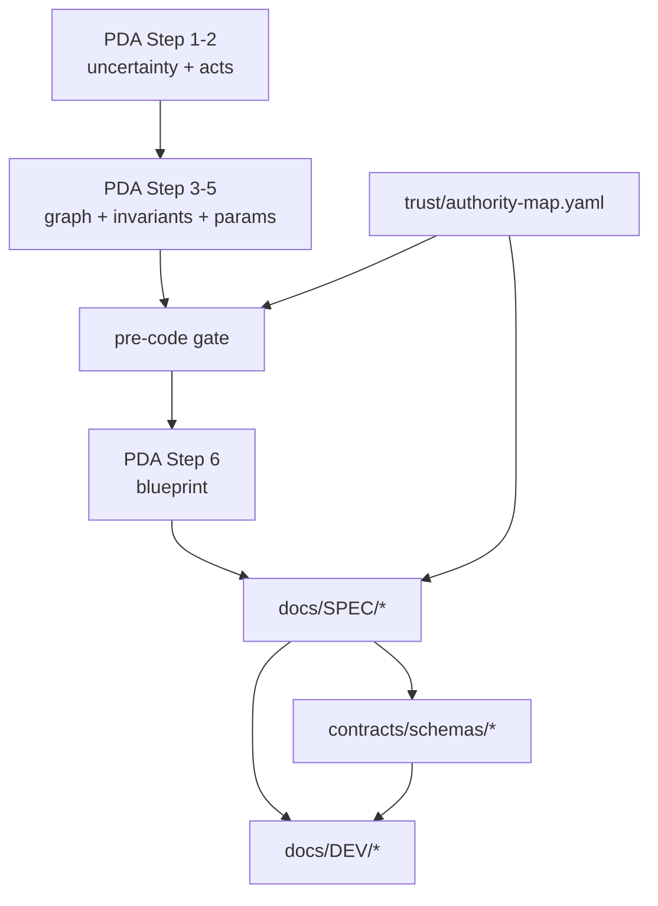

# GLT Specpack — Glyph Language for Topology

Переносимый specpack для standalone-проекта **GLT Control Plane**: наблюдаемая архитектура, анализ влияния изменений и контролируемые read/build-действия.

**Версия пакета:** 0.21.0 · 11.09.2026  
**Статус:** DEV-01…15 сделаны. S-1…S-8, S-10, `glt lint docs`, `glt lint authority`, `glt compile registry`, `glt verify`, `glt validate`, `glt resolve`, `glt compile snapshot`, `glt impact`, seeded failures, correctness gate, collectors и gate evaluator в CI; S-9 — предупреждение  
**Методология:** [Possibility-Driven Architecture (PDA)](../archive/Possibility-Driven_Architecture_Methodology_ru_v1_1.docx.md) v1.1 + [патч v1.2](../archive/PDA_patch_v1.2_structural_integrity.md)

---

## Что внутри

| Каталог | Назначение |
|---|---|
| [`docs/PRODUCT/`](docs/PRODUCT/) | Персона, jobs, scope, Definition of Useful |
| [`docs/PDA/`](docs/PDA/) | Восемь шагов PDA для GLT |
| [`docs/SPEC/`](docs/SPEC/) | Нормативная инженерная спецификация |
| [`docs/SECURITY/`](docs/SECURITY/) | Threat/trust model, bootstrap, sandbox |
| [`docs/OBSERVABILITY/`](docs/OBSERVABILITY/) | Метрики устойчивости, runbooks |
| [`docs/EXPERIMENTS/`](docs/EXPERIMENTS/) | B0/B1/G rubric, holdout, seeded failures |
| [`docs/DEV/`](docs/DEV/) | 35 зависимых шагов разработки |
| [`docs/00-governance/`](docs/00-governance/) | Metadata-контракт, нормативность, traceability |
| [`contracts/schemas/`](contracts/schemas/) | JSON Schema 2020-12 — единственный wire-контракт |
| [`contracts/propagation/`](contracts/propagation/) | Версионированная матрица распространения impact |
| [`contracts/events/`](contracts/events/) | Event Registry — единственный источник имён событий |
| [`contracts/examples/`](contracts/examples/) | Fixtures: valid, invalid, boundary, golden |
| [`registry/`](registry/) | Meta-registry GLT (`glt.controlplane.*`) |
| [`parameters/`](parameters/) | Parameter cards |
| [`trust/`](trust/) | Authority map, bootstrap manifest, seed keys |
| [`examples/targets/aeon/`](examples/targets/aeon/) | **non_normative** reference adopter |

Исходные материалы (не нормативны для пакета): [`archive/`](../archive/) — концепция GLT 2.0, методология PDA и её патч v1.2.

---

## Traceability: PDA → SPEC → contract → DEV



Каждый документ несёт YAML-frontmatter по [`metadata-contract.md`](docs/00-governance/metadata-contract.md). Один факт — один владелец: [`authority-map.yaml`](trust/authority-map.yaml).

---

## Bootstrap slice v1

Первый исполняемый boundary: **`glt.bootstrap-slice@1`**

```
RegistryEntry → Compiler → Check → Gate
```

Namespace: `glt.controlplane.*`. Рекурсия self-hosting заканчивается на **T0**: внешний root public key, минимальный bootstrap verifier, подписанный manifest.

v1 разрешает только: `inventory`, `validate`, `compile`, `typecheck`, `test`, `health`.  
**Исключено:** self-write, commit, push, self-upgrade, deploy.

---

## Запуск нового репозитория

1. Скопировать каталог `glt-specpack/` в корень нового репо (или использовать как monorepo root).
2. Инициализировать git; зафиксировать `trust/seed-public-keys/` (внешний T0, не из manifest).
3. Пройти [`pre-code-gate.md`](docs/00-governance/pre-code-gate.md) — все чеклисты зелёные.
4. Реализовать DEV-01…DEV-12 (волна 1: static + measurement).
5. Dogfood: GLT описывает собственную разработку через `registry/glt-controlplane.yaml`.
6. External witness подключается до Controlled Runner (DEV-30+).

Подробности: [`SPEC-PACK.md`](SPEC-PACK.md).

---

## Нормативность

- **normative** — единственный источник истины для класса фактов.
- **informative** — контекст, история, примеры.
- **non_normative** — reference adopters (`examples/targets/*`).

Поиск по пакету: нормативных ссылок на `aeon.*` в core **нет**; ÆON только в `examples/targets/aeon/`.

---

## Лицензия и provenance

Specpack создан из концепции GLT 2.0. При переносе сохраните `CHANGELOG.md` и `source_refs` в frontmatter документов.
