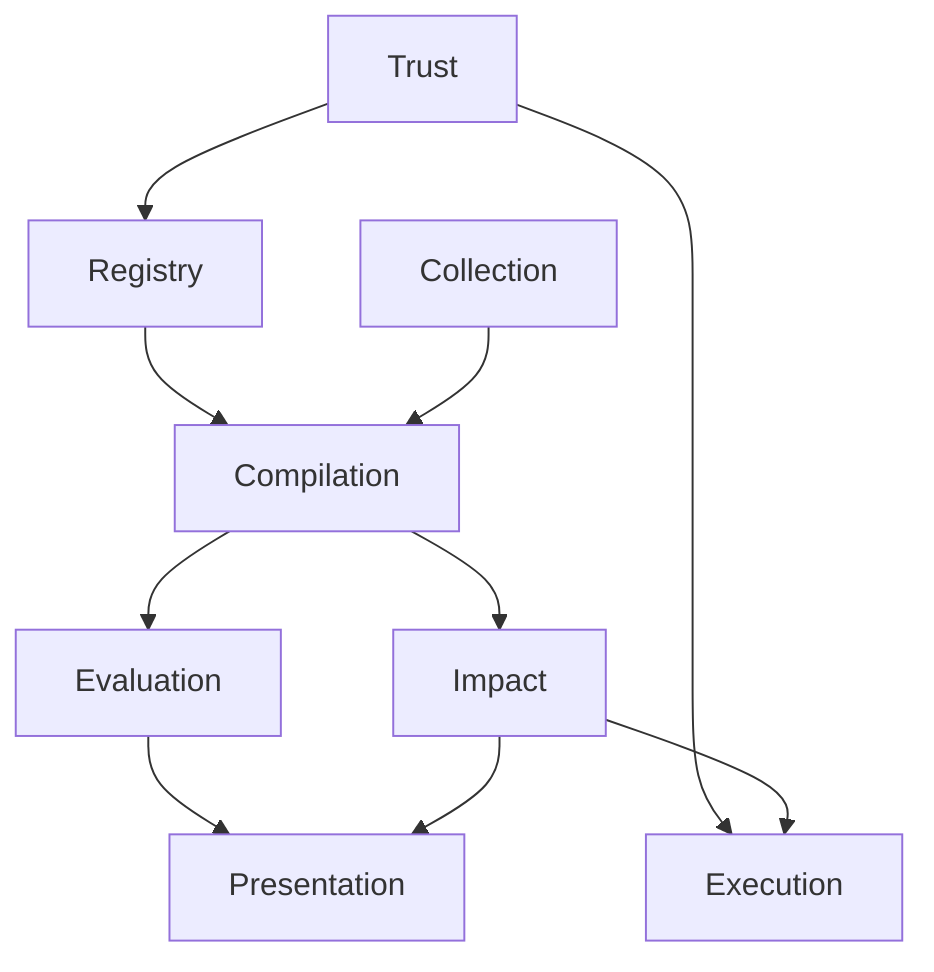
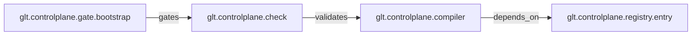

# PDA Step 3 — Domain Graph

GLT как bounded contexts и типизированный граф.

---

## Bounded contexts

| Context | Ответственность | Владелец |
|---|---|---|
| **Registry** | ID, aliases, ActionSpec, policy refs | registry |
| **Compilation** | Snapshot compiler, schema validation | snapshot-compiler |
| **Collection** | Git и CI collectors, materialized-факты | git-collector |
| **Evaluation** | State evaluator, freshness, конфликты | telemetry-collector |
| **Impact** | Change/incident propagation | engineering |
| **Execution** | Planner, policy, runner, audit | policy-engine |
| **Presentation** | Dashboard, CLI, glyph layer | engineering |
| **Trust** | Bootstrap, witness, authority | external-t0 |

Владелец — роль из [`../../trust/authority-map.yaml`](../../trust/authority-map.yaml). Деление работы, события на границах и протокол расширения графа: [`../00-governance/parallel-work.md`](../00-governance/parallel-work.md).

Ровно один владелец на контекст. До 0.4.0 существовал единый контекст **Observation** с двумя владельцами (`materialized-build` и `observed-runtime` — разные классы фактов), и он давал цикл: коллекторы подают факты в Compilation, а state evaluator потребляет из Compilation снимок. Разделение на **Collection** и **Evaluation** снимает и цикл, и двойное владение.

Зависимости между contexts. Конвенция стрелки: **`A --> B` читается как «B зависит от A»** — стрелка идёт от основания к зависимому. Без явной конвенции ацикличность не проверяема, а именно её отсутствие скрывало цикл через Observation.

Граф ацикличен: Trust — источник, Presentation — сток.

Audit-записи текут из Execution в audit store внутри Trust, но это **поток данных, а не зависимость**: контракт audit-цепочки не зависит от планировщика, наоборот. Ребра `Execution --> Trust` здесь быть не должно, иначе граф снова становится циклическим. Потоки данных на границах перечислены в [`../00-governance/parallel-work.md`](../00-governance/parallel-work.md).

---

## Entity Dictionary

| Entity | ID pattern | Описание |
|---|---|---|
| RegistryEntry | `glt.controlplane.registry.*` | Запись каталога |
| Node | `*.*` semantic id | Узел topology |
| Edge | `*.edge.*` | Типизированная связь |
| SourceRef | — | Происхождение факта |
| Snapshot | `snap-*` | Topology at as_of |
| ChangeEvent | `chg-*` | Детерминированно классифицированное изменение |
| ImpactReport | `imp-*` | Blast radius projection |
| Check | `*.check.*` | Валидация |
| Gate | `*.gate.*` | Release/merge policy |
| ActionSpec | `*.action.*` | Allowlisted action |
| ActionPlan | `plan-*` | Immutable execution DAG |
| AuditRecord | `aud-*` | Hash-chained log entry |
| Collector | `glt.collector.*` | Fact gatherer |
| WitnessReceipt | `wit-*` | External anchor |

---

## Edge Types Catalog

Четырнадцать отношений: `depends_on`, `reads`, `writes`, `calls`, `emits`, `consumes`, `builds`, `validates`, `observes`, `gates`, `deployed_as`, `conflicts_with`, `hosts`, `owns`. Enum — в [`../../contracts/schemas/edge.schema.json`](../../contracts/schemas/edge.schema.json).

Правила распространения здесь **не дублируются**. Они принадлежат классу фактов `impact-propagation-rules` и живут как версионированные данные в [`../../contracts/propagation/propagation-matrix.yaml`](../../contracts/propagation/propagation-matrix.yaml). Ранее эта страница несла собственную таблицу propagation, и она расходилась с матрицей: направление обхода не совпадало, а классы `data` и `deploy` не существуют среди change classes.

Направление ребра читается строго как `from —relation→ target`. Куда идёт impact, решает матрица, а не стрелка: для `depends_on` обход идёт **против** ребра. Отношения без строки в матрице перечислены в её `uncovered_relations` и дают `known_unknowns`.

---

## Bootstrap slice subgraph

Изменение контракта `registry.entry` идёт против ребра `depends_on` и достигает компилятора; изменение компилятора требует check; требуемый check переводит gate в `pending`.

Namespace `glt.controlplane.*` для self-description.

---

## Planes (cross-cutting)

Каждый Edge assertion независим per plane:

- **intended** — docs, registry declarations
- **materialized** — git, build artifacts
- **observed** — runtime telemetry

Origin classes: `declaration`, `discovery`, `observation`, `inference` — не уровни confidence.
