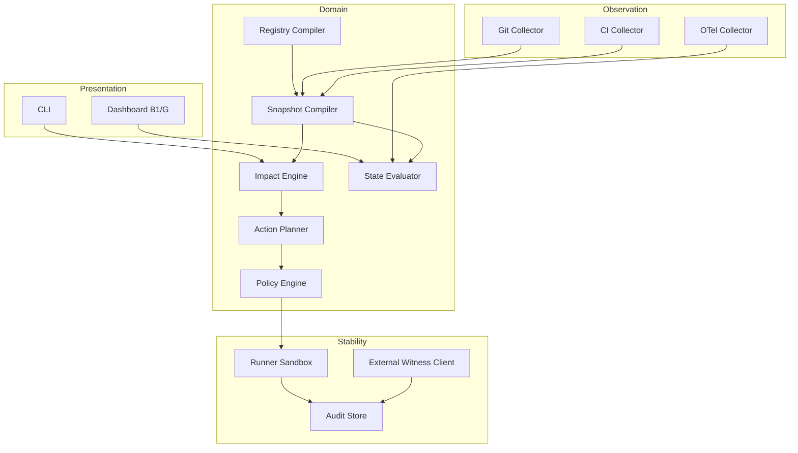

# PDA Step 6 — Architectural Blueprint

Event Core + Domain Layer + Stability Engine + projections.

---

## Component diagram

---

## Event Core (v1 minimal)

Append-only events for audit and replay:

- `ChangeSubmitted`, `SnapshotCompiled`, `ImpactComputed`
- `GateEvaluated`, `PlanApproved`, `ActionStarted`, `ActionCompleted`
- `AuditAppended`, `WitnessAnchored`

Full event catalog: [`../SPEC/events.md`](../SPEC/events.md).

---

## Domain Layer

Pure functions where possible:

- `resolve(alias, registry_version)`
- `compile_snapshot(sources, as_of)`
- `compute_impact(snapshot, change, boundary)`
- `evaluate_state(snapshot, observations)`
- `build_plan(request, action_specs)`

Validators co-located; no I/O in domain pure core.

---

## Stability Engine

- Policy broker (deny default)
- Approval broker (external for self-release)
- Runner isolation (VM/rootless container)
- Audit hash chain
- DLP on telemetry path

---

## Integration boundaries

| Boundary | Protocol | Direction |
|---|---|---|
| Git | read-only clone | in |
| CI | webhook + artifacts | in |
| OTel | gRPC/HTTP export | in |
| Witness | signed receipt API | out |
| User | CLI + HTTPS API | in |

No direct DB write from runner v1.

---

## Deployment v1

- **Wave 1–2:** CLI + static files + optional local SQLite for snapshots
- **Wave 3:** Compose: api + postgres + redis + otel-collector
- **Wave 4:** Runner as separate worker pool

---

## Self-hosting topology

GLT describes itself in `registry/glt-controlplane.yaml`. Bootstrap slice first; expand after DEV-21.

См. [`../SPEC/self-hosting.md`](../SPEC/self-hosting.md).
