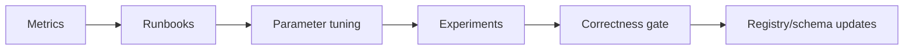

# PDA Step 7 — Feedback loops и observability

Наблюдаемость **устойчивости**, не только роста.

---

## Stability metrics (primary)

| Metric | Type | Alert |
|---|---|---|
| `glt_snapshot_compile_errors_total` | counter | >0 in 1h |
| `glt_impact_compute_duration_seconds` | histogram | p95 > 30s |
| `glt_authority_violations_total` | counter | any |
| `glt_audit_chain_verify_failures` | counter | any |
| `glt_runner_unknown_outcome_total` | counter | trend up |
| `glt_witness_staleness_seconds` | gauge | > P06 |
| `glt_freshness_stale_nodes` | gauge | >10% topology |
| `glt_dlp_canary_leak_total` | counter | any |

---

## Domain incident class

Отдельно от infra incidents:

| Class | Example | Response |
|---|---|---|
| `spec_drift` | Intended edge missing in materialized | Block gate, notify owner |
| `registry_conflict` | Duplicate alias | Verifier fail |
| `false_complete_impact` | known_unknowns empty outside boundary | Sev-2 bug |
| `self_cycle_detected` | CP approves own release | Policy deny + audit |
| `witness_stale` | No anchor > P06 | Degrade to read-only |

Runbooks: [`../OBSERVABILITY/runbooks/`](../OBSERVABILITY/runbooks/).

---

## Feedback loops



1. **Compile loop:** snapshot errors → fix SourceRef / DEV metadata
2. **Impact loop:** golden case misses → traversal matrix / boundary
3. **Runner loop:** unknown_outcome → reconciliation runbook
4. **UX loop:** B1 task fail → dashboard IA, not more glyphs

---

## SLOs (draft)

| SLO | Target v1 |
|---|---|
| Snapshot compile success | 99.5% |
| Impact p95 latency | <10s slice, <30s full |
| Audit verify | 100% daily job |
| API availability (wave 3) | 99% |

---

## OTel resource attributes

```
service.name=glt-controlplane
glt.registry_version=
glt.snapshot_id=
glt.boundary_id=
```

См. [`../OBSERVABILITY/metrics.md`](../OBSERVABILITY/metrics.md).
