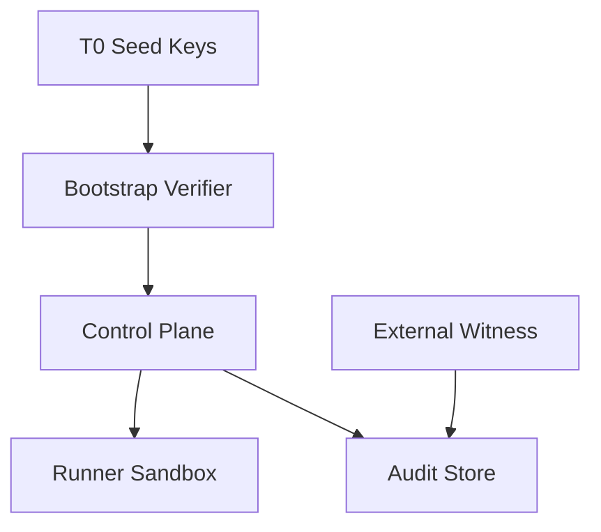

# Threat model

## Assets

- Registry integrity
- Topology snapshots
- Audit chain
- Runner sandbox
- Witness anchors
- Operator credentials

## Threat scenarios (must pass Safety gate)

| # | Threat | Control |
|---|---|---|
| T1 | Forged evidence in snapshot | SourceRef digest + authority map |
| T2 | Self-approval of CP release | External approver + policy deny |
| T3 | Circular validation (CP validates CP release) | T0 + anti-cycle tests |
| T4 | Runner escape to host | Sandbox + seccomp + no socket |
| T5 | Stale witness trusted | P06 staleness → read-only |
| T6 | unknown_outcome blind retry | Reconciliation runbook |
| T7 | PII in topology | DLP + allowlist schema |
| T8 | Tampered audit chain | Hash verify job |
| T9 | LLM gate bypass | Deterministic classifier only |
| T10 | Supply-chain bad executor image | Pinned signed image digest |

## Trust boundaries

## Out of scope v1

Nation-state APT on HSM, multi-region DR (documented gap).
