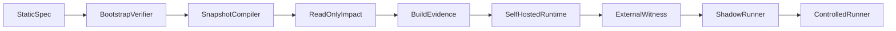

# Self-hosting

## Bootstrap path

## T0 trust termination

Recursion ends at:

- External root public key in `trust/seed-public-keys/` (not from manifest under verification)
- Minimal bootstrap verifier + schema
- Signed bootstrap manifest
- Trusted builder identity (separate from runtime)
- Release policy requiring external approval for CP releases

## Self-topology namespace

`glt.controlplane.*` — compiler, registry, graph, impact, dashboard, collectors, policy, runner, audit store.

## Anti-cycle rules

1. CP cannot approve own release
2. State Evaluator does not create evidence
3. Self-report ≠ external proof
4. Build attestation, deployment digest, witness from **different** trust domains

## v1 scope

Read-only observation of own repo + read/build runner. No self-write/deploy.

## External witness

Independent service anchors audit chain head. Staleness: param P06.

See [`../SECURITY/external-witness.md`](../SECURITY/external-witness.md).

## Acceptance

DEV-28: anti-cycle acceptance test suite.
