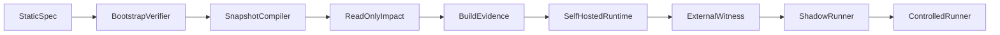

# Self-hosting

## Bootstrap path

## T0 trust termination

Recursion ends at:

- External root public key in `trust/seed-public-keys/` (not from manifest under verification)
- Minimal bootstrap verifier + schema
- Signed bootstrap manifest
- Trusted builder identity (separate from runtime)
- Release policy requiring external approval for CP releases

## Self-topology namespace

`glt.controlplane.*` — compiler, registry, graph, impact, dashboard, collectors, policy, runner, audit store.

## Anti-cycle rules

1. CP cannot approve own release
2. State Evaluator does not create evidence
3. Self-report ≠ external proof
4. Build attestation, deployment digest, witness from **different** trust domains

## v1 scope

Read-only observation of own repo + read/build runner. No self-write/deploy.

## Compose (DEV-25)

The only v1 self-host path is Docker Compose. The file is
[`../../../deploy/compose.yaml`](../../../deploy/compose.yaml). The CLI has
no deploy verb (S-10). A second compose file at the repository root is a
second mechanism (S-4).

Stack, from the blueprint: **api**, **postgres**, **redis**, **otel-collector**.
The API still compiles on the fly; postgres is the DEV-22 store server, not a
new write route. Redis is optional session cache and stays unpublished.
The collector receives OTLP; the document is still the DEV-24 export, not an
SDK.

### Pin

Every pulled image and every `FROM` is `name[:tag]@sha256:` plus 64 hex digits.
A tag without a digest is not a pin (PROTO-10). The local API image is built
from the pinned `FROM`; it is not pulled.

### Secrets

Secrets are not in the repository. Copy
[`../../../deploy/.env.example`](../../../deploy/.env.example) to `deploy/.env`
on the machine and set `POSTGRES_PASSWORD` there. Compose interpolates
`${POSTGRES_PASSWORD:?set in deploy/.env}` — unset fails. `.env` is gitignored.

### Bind

`pnpm api` defaults to `127.0.0.1`. Inside the container `HOST=0.0.0.0`.
The host publishes only `127.0.0.1:4174`. Publishing the API, postgres or redis
on all host interfaces is forbidden.

### Clean machine

1. Install Docker Engine and the Compose plugin.
2. Clone this repository.
3. `cp deploy/.env.example deploy/.env` and set `POSTGRES_PASSWORD`.
4. `docker compose -f deploy/compose.yaml --env-file deploy/.env up --build`
5. `GET http://127.0.0.1:4174/v1/health` with `GLT-Actor` and `GLT-Role: reader`.

## Self-topology (DEV-27)

The control plane observes **this** repository. The description is
[`../../registry/glt-controlplane.yaml`](../../registry/glt-controlplane.yaml).
The namespace is `glt.controlplane`. Compile and git collection stay
read-only. No `glt` verb is added (S-10). The registry YAML is not a
second graph: new nodes still go through the architect (S-4).

`observeSelfTopology` in `packages/domain` is the one composition. It
does not compile and does not talk to git. Registry ids, deploy/build
hashes and `detect_seconds` arrive already parsed. Drift class is
`classifyDeployDrift` — a second hash compare would be a second
mechanism. `detect_seconds` is already in seconds (S-8); millisecond
arithmetic lives outside domain.

### Seeded drift (E05)

A seed is a deploy/build pin that is not aligned. Detection is
`drift`, not silence (PROTO-12). Time to detect is recorded on the
observation as `detect_seconds` and published as
`glt_self_observation_drift_detect_seconds`. An aligned pin is not a
detection: `requireSeededDriftDetected` reports evidence insufficient.

### Self-observation ≠ approval (INV-09)

The observation never grants `approve`. `grants_approve` is always
false. Seeing own topology, compiling own snapshot, or collecting own
git facts is not a release approval. `glt-cp-runtime@internal` still
cannot approve. External identity is still required for a
`glt.controlplane.*` release. See [`policy.md`](policy.md).

Anchor of the audit head is DEV-28, not this step.

## External witness (DEV-28)

The audit head is anchored by a **third party**. The client is
`anchorHead` in `packages/audit`. The receipt is saved. Staleness is
P06 through `snapshotIsStale` (S-4). Past P06, or no external receipt,
is read-only.

The URL is `WITNESS_ENDPOINT` on the machine. It is not a service in
`deploy/compose.yaml`. `example.invalid` is rejected. Local chain
verify is not a witness (INV-09).

See [`../SECURITY/external-witness.md`](../SECURITY/external-witness.md).

## Supply chain (DEV-34)

A control-plane release is admitted by `admitRelease`, not by
Compose coming up and not by self-observation. Images are pinned by
digest and signed (`verifyBytes`). The same pinned inputs yield the
same input digest (`digestOf`, PROTO-03). External approval is
required; `glt-cp-runtime@internal` cannot approve (INV-09). The
policy file is `trust/release-policy.yaml`. Filling
`release_trust_roots.allowed` is DEV-35. No `glt release` (S-10).

See [`../SECURITY/supply-chain.md`](../SECURITY/supply-chain.md).

## Acceptance

DEV-28: anti-cycle acceptance test suite.
