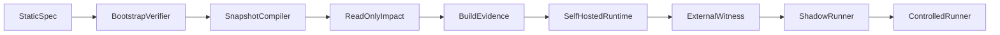

# Self-hosting

## Bootstrap path

## T0 trust termination

Recursion ends at:

- External root public key in `trust/seed-public-keys/` (not from manifest under verification)
- Minimal bootstrap verifier + schema
- Signed bootstrap manifest
- Trusted builder identity (separate from runtime)
- Release policy requiring external approval for CP releases

## Self-topology namespace

`glt.controlplane.*` — compiler, registry, graph, impact, dashboard, collectors, policy, runner, audit store.

## Anti-cycle rules

1. CP cannot approve own release
2. State Evaluator does not create evidence
3. Self-report ≠ external proof
4. Build attestation, deployment digest, witness from **different** trust domains

## v1 scope

Read-only observation of own repo + read/build runner. No self-write/deploy.

## Compose (DEV-25)

The only v1 self-host path is Docker Compose. The file is
[`../../../deploy/compose.yaml`](../../../deploy/compose.yaml). The CLI has
no deploy verb (S-10). A second compose file at the repository root is a
second mechanism (S-4).

Stack, from the blueprint: **api**, **postgres**, **redis**, **otel-collector**.
The API still compiles on the fly; postgres is the DEV-22 store server, not a
new write route. Redis is optional session cache and stays unpublished.
The collector receives OTLP; the document is still the DEV-24 export, not an
SDK.

### Pin

Every pulled image and every `FROM` is `name[:tag]@sha256:` plus 64 hex digits.
A tag without a digest is not a pin (PROTO-10). The local API image is built
from the pinned `FROM`; it is not pulled.

### Secrets

Secrets are not in the repository. Copy
[`../../../deploy/.env.example`](../../../deploy/.env.example) to `deploy/.env`
on the machine and set `POSTGRES_PASSWORD` there. Compose interpolates
`${POSTGRES_PASSWORD:?set in deploy/.env}` — unset fails. `.env` is gitignored.

### Bind

`pnpm api` defaults to `127.0.0.1`. Inside the container `HOST=0.0.0.0`.
The host publishes only `127.0.0.1:4174`. Publishing the API, postgres or redis
on all host interfaces is forbidden.

### Clean machine

1. Install Docker Engine and the Compose plugin.
2. Clone this repository.
3. `cp deploy/.env.example deploy/.env` and set `POSTGRES_PASSWORD`.
4. `docker compose -f deploy/compose.yaml --env-file deploy/.env up --build`
5. `GET http://127.0.0.1:4174/v1/health` with `GLT-Actor` and `GLT-Role: reader`.

## External witness

Independent service anchors audit chain head. Staleness: param P06.

See [`../SECURITY/external-witness.md`](../SECURITY/external-witness.md).

## Acceptance

DEV-28: anti-cycle acceptance test suite.
